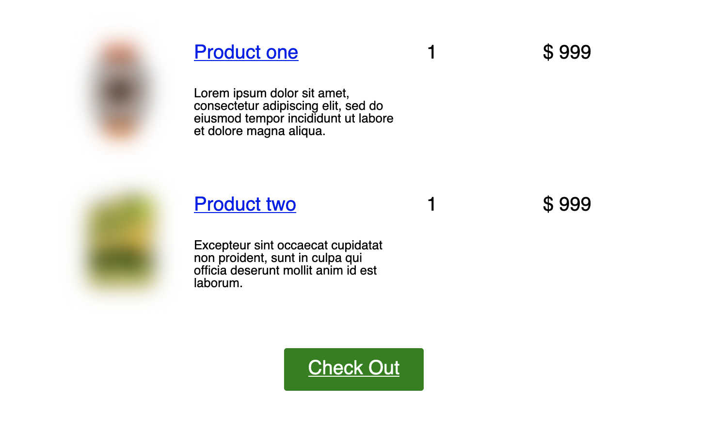

The plugin provides the token to be used in emails. The token is `{custom-object-list=<custom-object-name>}`.

## Usage

Use the following token in email,
`{custom-object-list=adandoned_cart}`.

This will inject the abandoned product listing into email body. See 
